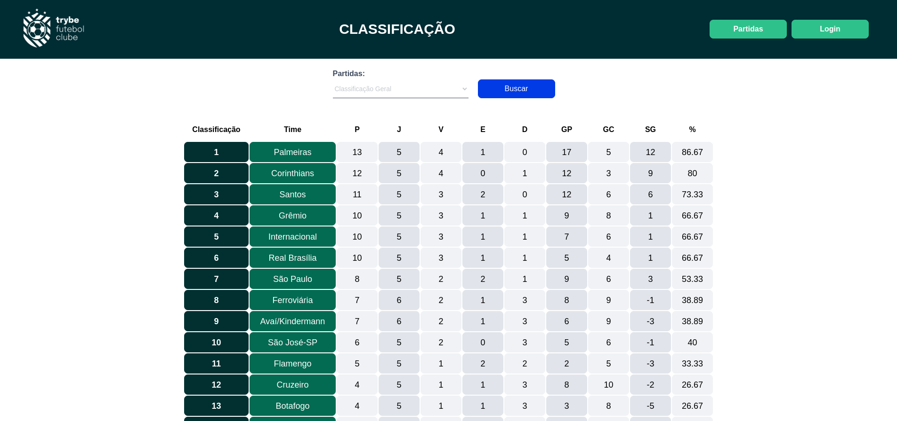

# :soccer: Futebol Club :soccer:

 

# :camera_flash: Imagens do Projeto

 
 

 

# :clipboard: About
O Projeto se trata de uma aplicação full stack onde foi incrementado a construção da API para o front-end, utilizando Typescript, node e sequelize, juntamente das 
metodologias da Programação Orientada a Objetos, e SOLID. Na aplicação, é possivel ver os resultados das partidas, filtralos, logar em sua conta, mudar o status da partida,
adicionar uma partida entre outras funções. Toda a aplicação é testada com Mocha, Jest, chai e sinon e utiliza de validações e criptografias junto do banco de dados MySQL

 

# :hammer_and_wrench: Skills & Tools

- Node.js
- Express
- Sequelize
- MySQL
- Docker
- Typescript
- Mocha / chai / sinon
- JWT
- React
- Javascript(ES6+)
- Jest

 
